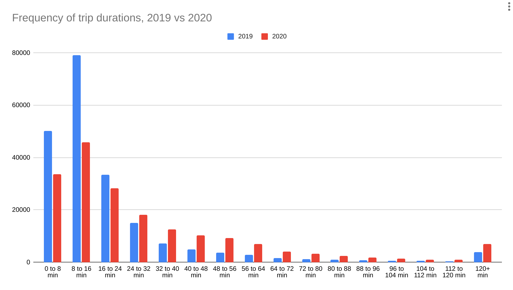

# Assignment 1

**Due: Sept 19, 2021 by 11:59pm ET**

## Datasets

* Indego Bikeshare data station status data
* Indego Trip data
  - Q2 2020
  - Q2 2019

All data is available from [Indego's Data site](https://www.rideindego.com/about/data/).

Load all three datasets into your CARTO account.

Fork this repository and fill in each of the SQL files corresponding to the questions below. Submit a pull request back to the original repository with your answers.

1. [How many bike trips in Q2 2019?](query01.sql)

    This file is filled out for you, as an example.

    ```SQL
    SELECT count(*)
    FROM indego_trips_2019_q2
    ```

    **Result:** 206354

2. [What is the percent change in trips in Q2 2020 as compared to Q2 2019?](query02.sql)
    _Bonus: If you want to get fancier here, you can cast the result to a string and concatenate a `'%'` to the end. For example, `(10 + 3.2)::text || '%' AS perc_change`. This uses the type casting (number to string) and string concatenation operator (`||`, double pipes) that's essentially a `+` for strings._

    **Result:** -9.58%

3. [What is the average duration of a trip for 2019?](query03.sql)

    **Result:** 23.6740698023784371 minutes

4. [What is the average duration of a trip for 2020?](query04.sql)

    **Result:** 39.2360091325179810 minutes

    _What do you notice about the difference in trip lengths? Give a few explanations for why there could be a difference here._

    **Answer:** The average trip length nearly doubled. A possible reason is that, with the pandemic, riders were less comfortable spending long rides inside of transit vehicles, so longer trips that would have been made on a bus or subway were converted into bike share trips (this in spite of a reduction in the overall bikeshare trip count, which could be because fewer people were going places in general).

    Alternatively, people were taking fewer short-duration trips. These kinds of trips might be more common when people are frequently out in social situations -- going from one bar or restaurant to the next within the same or near-by neighborhoods (downtown).

    Digging a little deeper into the data, we could see evidence for either of these possibilities:

    ```sql
    with histogram_2019 as (
        select width_bucket(duration, 0, 120, 15) as bucket,
               count(*) as cnt
        from indego_trips_2019_q2
        group by bucket
        order by bucket
    ),

    histogram_2020 as (
        select width_bucket(duration, 0, 120, 15) as bucket,
               count(*) as cnt
        from indego_trips_2020_q2
        group by bucket
        order by bucket
    )

    select
        case
            when bucket <= 15
            then ((bucket - 1) * (120 / 15))::text || ' to ' || (bucket * (120 / 15))::text
            else ((bucket - 1) * (120 / 15))::text || '+'
        end || ' min' as range,
        h2019.cnt as cnt_2019,
        h2020.cnt as cnt_2020
    from histogram_2019 h2019
    join histogram_2020 h2020 using (bucket)
    ```

    | range | cnt_2019 | cnt_2020 |
    |-------|----------|----------|
    | 0 to 8 min | 50203 | 33717 |
    | 8 to 16 min | 79205 | 45776 |
    | 16 to 24 min | 33443 | 28174 |
    | 24 to 32 min | 15102 | 18079 |
    | 32 to 40 min | 7239 | 12622 |
    | 40 to 48 min | 4919 | 10316 |
    | 48 to 56 min | 3715 | 9309 |
    | 56 to 64 min | 2795 | 6878 |
    | 64 to 72 min | 1567 | 4150 |
    | 72 to 80 min | 1167 | 3171 |
    | 80 to 88 min | 885 | 2329 |
    | 88 to 96 min | 752 | 1788 |
    | 96 to 104 min | 565 | 1426 |
    | 104 to 112 min | 458 | 1060 |
    | 112 to 120 min | 373 | 900 |
    | 120+ min | 3966 | 6891 |

    

5. [What is the longest duration trip?](query05.sql)

    **Result:** 1440 minutes (i.e., 24 hours)

    _Why are there so many trips of this duration?_

    **Answer:** That's the maximum trip duration that Indego chooses to record (24 hours). Perhaps this means they'll never charge a customer more than for 24 hours. We can see that for trips with `duration < 1440` the `end_time - start_time` matches the `duration`, but for trips with `duration = 1440`, the `end_time - start_time` is a day or more.

6. [How many trips were shorter than 10 minutes?](query06.sql)

    **Result:** 121687

7. [How many trips started on one day and ended in the next?](query07.sql)

    _Hint 1: date strings can be parsed using the text type to datetime type conversion function [`to_timestamp`](https://www.postgresql.org/docs/12/functions-formatting.html). See the section on [Template Patterns for Date/Time Formatting](https://www.postgresql.org/docs/12/functions-formatting.html#FUNCTIONS-FORMATTING-DATETIME-TABLE) for options on choosing the right string format. The 2020 dataset has the timestamp in a slightly unusual format so you need to tell PostgreSQL how to parse it. The 2019 data should already be in a good format._

    _Hint 2: Days of the month can be retrieved from a timestamp using the [EXTRACT](https://www.postgresql.org/docs/12/functions-datetime.html#FUNCTIONS-DATETIME-EXTRACT) function. See also some of the follow alongs from the Lecture in week 2._

    **Result:** 4332

8. [Give the five most popular starting stations between 7am and 10am in 2019.](query08.sql)

    _Hint: Use the `EXTRACT` function to get the hour of the day from the timestamp._

    **Result:** The stations with IDs `3102`, `3012`, `3007`, `3057`, and `3066` (though the exact order of popularity will be different depending if you include `'10:00'` as a valid start time or not).

9. [List all the passholder types and number of trips for each.](query09.sql)

    **Result:**
    | passholder_type | num_trips |
    |-----------------|-----------|
    | Day Pass | 72362 |
    | Indego30 | 263249 |
    | Indego365 | 56358 |
    | IndegoFlex | 852 |
    | Walk-up | 84 |
    | `null` | 35 |

10. [Using the station status dataset, find the distance in meters of all stations from Meyerson Hall.](query10.sql)

    **Result:** The first 5 closest of these are:

    | name | distance (m) |
    |------|--------------|
    | 34th & Spruce | 222.00977839105403 |
    | 34th & Chestnut | 227.45582279663964 |
    | 36th & Sansom | 231.23446720270147 |
    | 33rd & Market | 444.8926090618996 |
    | University City Station | 488.60841226668293 |

    For a short explanation of my numbers and choice of projection, see https://youtu.be/fwJVR0DAlq4

> **A quick note** on my choice of PostGIS function for the following answers:
> * For #11 I use `ST_Distance`
> * For #12 I use `ST_DWithin`
> * For #13 and #14 I use the distance operator (`<->`)
>
> Each of these is appropriate at different times. In #12-14, I'm filtering the records that I'm interested in (for #12, it's just those records that are within a km of a point, for #13 & 14 it's only the closest or farthest records from a point) so I choose distance operations that can take advantage of spatial indexes. Those operations are listed [here](http://postgis.net/workshops/postgis-intro/indexing.html#spatially-indexed-functions) (in addition to the [distance operator](https://postgis.net/docs/geometry_distance_knn.html)). That way PostGIS can do a quick elimination of many rows using the index.
>
> For #11 I know that I'm going to have to calculate the actual distance on each record to get the average, so it doesn't matter whether I use an index-enabled operation or not. The index is useful for determining what I _don't_ have to look at. For those records I do have to look at, the index isn't going to make my distance calculation any faster.

11. [What is the average distance (in meters) of all stations from Meyerson Hall?](query11.sql)

    **Result:** 2859.8037516355557 m

12. [How many stations are within 1km of Meyerson Hall?](query12.sql)

    **Result:** 14 (when using state plane; 8 when using mercator)

13. [Which station is furthest from Meyerson Hall?](query13.sql)

    **Result:** 15th & Kitty Hawk (7072.45 m)

14. [Which station is closest to Meyerson Hall?](query14.sql)

    **Result:** 34th & Spruce (222 m)
